# background_blur
```python
import numpy as np
import pandas as pd
import keras
import matplotlib.pyplot as plt
import os
import tensorflow as tf
from keras.models import Sequential
from keras.layers import Conv2D, MaxPool2D, UpSampling2D, Input, Concatenate, Conv2DTranspose, BatchNormalization, Activation
from keras.optimizers import Adam
from keras.callbacks import ModelCheckpoint,LearningRateScheduler
from keras.preprocessing.image import ImageDataGenerator
from keras import Model,regularizers
import tensorflow as tf
from PIL import Image, ImageFilter,GifImagePlugin
```


```python
Img_width = 256
Img_height = 256

batch_size = 16
epochs = 100

```


```python
def load_data(is_train = True):
    path = os.path.join('/Users','egormatolygin','Data','P3M-10k','train_list.txt') 
    file = open(path)
    imageNames = file.read().split()
    train = []
    for name in imageNames:
        imagePath = os.path.join('/Users','egormatolygin','Data','P3M-10k','train','blurred_image',name+'.jpg')
        labelPath = os.path.join('/Users','egormatolygin','Data','P3M-10k','train','mask',name+'.png')
        train.append([imagePath,labelPath])
    file.close()
    val = []
    imageNames = [im.removesuffix('.jpg') for im in os.listdir('/Users/egormatolygin/Data/P3M-10k/validation/P3M-500-NP/original_image')]
    for name in imageNames:
        imagePath = os.path.join('/Users','egormatolygin','Data','P3M-10k','validation','P3M-500-NP','original_image',name+'.jpg')
        labelPath = os.path.join('/Users','egormatolygin','Data','P3M-10k','validation','P3M-500-NP','mask',name+'.png')
        val.append([imagePath,labelPath])
        
    return train,val
```


```python
train,val = load_data()
```


```python
plt.figure(figsize=(15,15))
idx = 0
img = 0
mask = 0
for image in train[:5]:
    plt.subplot(5,2,idx+1)
    plt.imshow(Image.open(image[0]))
    plt.subplot(5,2,idx+2)
    plt.imshow(Image.open(image[1]))
    idx+=2
    
```


    
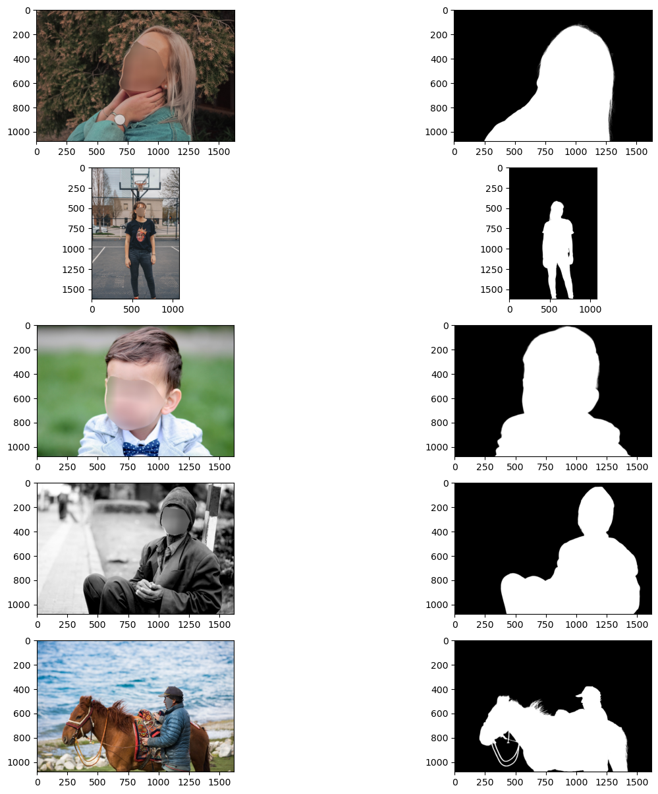
    


```python
def prep_image_and_mask(train,val):
    Images_train = []
    Masks_train = []
    Images_val = []
    Masks_val = []
    
    for pair in train:
        Img = Image.open(pair[0])
        Img = Img.resize((Img_height,Img_width),resample = Image.BILINEAR)
        Images_train.append(np.array(Img))
        Mask = Image.open(pair[1])
        Mask = Mask.resize((Img_height,Img_width),resample = Image.BILINEAR)
        Mask = np.array(Mask)[:,:,0]
        Mask = Mask/255
        Masks_train.append(Mask.reshape(Img_width,Img_height,1))

    for pair in val:
        Img = Image.open(pair[0])
        Img = Img.resize((Img_height,Img_width),resample = Image.BILINEAR)
        Images_val.append(np.array(Img))
        Mask = Image.open(pair[1])
        Mask = Mask.resize((Img_height,Img_width),resample = Image.BILINEAR)
        Mask = np.array(Mask)[:,:,0]
        Mask = Mask/255
        Masks_val.append(Mask.reshape(Img_width,Img_height,1))

    return np.array(Images_train), np.array(Masks_train), np.array(Images_val),np.array(Masks_val)
```


```python
Images_train, Masks_train, Images_val, Masks_val = prep_image_and_mask(train,val)
plt.subplot(1,2,1)
plt.imshow(Images_train[0])
plt.subplot(1,2,2)
plt.imshow(Masks_train[0])
```


    <matplotlib.image.AxesImage at 0x29699cf10>


    
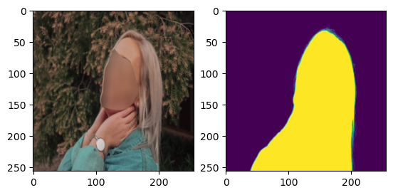
    


```python
print(Images_train.shape,Masks_train.shape,Images_val.shape,Masks_val.shape)
```

    (9421, 256, 256, 3) (9421, 256, 256, 1) (500, 256, 256, 3) (500, 256, 256, 1)


```python
def get_model():
    x = Input(shape=(256,256,3))
    
    conv1 = Conv2D(kernel_size=3,filters=64, strides=1, padding='same',input_shape = (256,256,3),
                   kernel_regularizer=regularizers.l2(0.0001))(x)
    #conv1 = BatchNormalization()(conv1)
    conv1 = Activation('relu')(conv1)
    conv2 = Conv2D(kernel_size=3,filters=64, strides=1, padding='same',kernel_regularizer=regularizers.l2(0.0001))(conv1)
    #conv2 = BatchNormalization()(conv2)
    conv2 = Activation('relu')(conv2)
    pool1 = MaxPool2D(pool_size=(2,2))(conv2)
    
   
    conv3 = Conv2D(kernel_size=3,filters=64, strides=1, padding='same',kernel_regularizer=regularizers.l2(0.0001))(pool1)
    #conv3 = BatchNormalization()(conv3)
    conv3 = Activation('relu')(conv3)
    conv4 = Conv2D(kernel_size=3,filters=64, strides=1, padding='same',kernel_regularizer=regularizers.l2(0.0001))(conv3)
    #conv4 = BatchNormalization()(conv4)
    conv4 = Activation('relu')(conv4)
    pool2 = MaxPool2D(pool_size=(2,2))(conv4)
    
    conv5 = Conv2D(kernel_size=3,filters=128,strides=1, padding='same',kernel_regularizer=regularizers.l2(0.0001))(pool2)
    #conv5 = BatchNormalization()(conv5)
    conv5 = Activation('relu')(conv5)
    conv6 = Conv2D(kernel_size=3, filters=128, strides=1, padding='same',kernel_regularizer=regularizers.l2(0.0001))(conv5)
    #conv6 = BatchNormalization()(conv6)
    conv6 = Activation('relu')(conv6)
    conv7 = Conv2D(kernel_size=3, filters=128, strides=1, padding='same',kernel_regularizer=regularizers.l2(0.0001))(conv6)
    #conv7 = BatchNormalization()(conv7)
    conv7 = Activation('relu')(conv7)
    pool3 = MaxPool2D(pool_size=(2,2))(conv7)
    
   
    conv8 = Conv2D(kernel_size=3, filters=256, strides=1, padding='same',kernel_regularizer=regularizers.l2(0.0001))(pool3)
    #conv8 = BatchNormalization()(conv8)
    conv8 = Activation('relu')(conv8)
    conv9 = Conv2D(kernel_size=3, filters=256, strides=1, padding='same',kernel_regularizer=regularizers.l2(0.0001))(conv8)
    #conv9 = BatchNormalization()(conv9)
    conv9 = Activation('relu')(conv9)
    upconv1 = Conv2DTranspose(kernel_size=3,filters=128, strides=(2,2), padding='same',kernel_regularizer=regularizers.l2(0.0001))(conv9)
    #upconv1 = BatchNormalization()(upconv1)
    upconv1 = Activation('relu')(upconv1)
    
    skip1 = Concatenate(axis = 3)([upconv1,conv7])
    conv10 = Conv2D(kernel_size=3, filters=128, strides=1, padding='same',kernel_regularizer=regularizers.l2(0.0001))(skip1)
    #conv10 = BatchNormalization()(conv10)
    conv10 = Activation('relu')(conv10)
    conv11 = Conv2D(kernel_size=3, filters=128, strides=1, padding='same',kernel_regularizer=regularizers.l2(0.0001))(conv10)
    #conv11 = BatchNormalization()(conv11)
    conv11 = Activation('relu')(conv11)
    conv12 = Conv2D(kernel_size=3, filters=128, strides=1, padding='same', kernel_regularizer=regularizers.l2(0.0001))(conv11)
    #conv12 = BatchNormalization()(conv12)
    conv12 = Activation('relu')(conv12)
    upconv2 = Conv2DTranspose(kernel_size=3,filters=64, strides=(2,2), padding='same',kernel_regularizer=regularizers.l2(0.0001))(conv12)
    #upconv2 = BatchNormalization()(upconv2)
    upconv2 = Activation('relu')(upconv2)
    

    skip2 = Concatenate(axis = 3)([upconv2,conv4])
    conv13 = Conv2D(kernel_size=3, filters=64, strides=1, padding='same',kernel_regularizer=regularizers.l2(0.0001))(upconv2)
    #conv13 = BatchNormalization()(conv13)
    conv13 = Activation('relu')(conv13)
    conv14 = Conv2D(kernel_size=3, filters=64, strides=1, padding='same', kernel_regularizer=regularizers.l2(0.0001))(conv13)
    #conv14 = BatchNormalization()(conv14)
    conv14 = Activation('relu')(conv14)
    upconv3 = Conv2DTranspose(kernel_size=3,filters=64, strides=(2,2), padding='same',kernel_regularizer=regularizers.l2(0.0001))(conv14)
    #upconv3 = BatchNormalization()(upconv3)
    upconv3 = Activation('relu')(upconv3)

    skip3 = Concatenate(axis = 3)([upconv3,conv2])
    conv15 = Conv2D(kernel_size=3, filters=64, strides=1, padding='same', kernel_regularizer=regularizers.l2(0.0001))(upconv3)
    #conv15 = BatchNormalization()(conv15)
    conv15 = Activation('relu')(conv15)
    output = Conv2D(kernel_size=3, filters=1, strides=1, padding='same', activation='sigmoid', 
                    kernel_regularizer=regularizers.l2(0.0001))(conv15)

    model = Model(inputs = x, outputs = output)
    model.summary()
    optimizer = Adam(learning_rate=0.01)
    model.compile(loss ='binary_crossentropy',optimizer=optimizer, metrics=['accuracy'])

    return model

def get_model1():
    x = Input(shape=(256,256,3))
    
    conv1 = Conv2D(kernel_size=3,filters=64, strides=1, padding='same',input_shape = (256,256,3),
                  kernel_regularizer=regularizers.l2(0.0001))(x)
    conv1 = BatchNormalization()(conv1)
    conv1 = Activation('relu')(conv1)
    conv2 = Conv2D(kernel_size=3,filters=64, strides=1, padding='same',kernel_regularizer=regularizers.l2(0.0001))(conv1)
    conv2 = BatchNormalization()(conv2)
    conv2 = Activation('relu')(conv2)
    pool1 = MaxPool2D(pool_size=(2,2))(conv2)
    
   
    conv3 = Conv2D(kernel_size=3,filters=64, strides=1, padding='same',kernel_regularizer=regularizers.l2(0.0001))(pool1)
    conv3 = BatchNormalization()(conv3)
    conv3 = Activation('relu')(conv3)
    conv4 = Conv2D(kernel_size=3,filters=64, strides=1, padding='same',kernel_regularizer=regularizers.l2(0.0001))(conv3)
    conv4 = BatchNormalization()(conv4)
    conv4 = Activation('relu')(conv4)
    pool2 = MaxPool2D(pool_size=(2,2))(conv4)
    
    conv5 = Conv2D(kernel_size=3,filters=128,strides=1, padding='same',kernel_regularizer=regularizers.l2(0.0001))(pool2)
    conv5 = BatchNormalization()(conv5)
    conv5 = Activation('relu')(conv5)
    conv6 = Conv2D(kernel_size=3, filters=128, strides=1, padding='same',kernel_regularizer=regularizers.l2(0.0001))(conv5)
    conv6 = BatchNormalization()(conv6)
    conv6 = Activation('relu')(conv6)
    pool3 = MaxPool2D(pool_size=(2,2))(conv6)
    
   
    conv8 = Conv2D(kernel_size=3, filters=256, strides=1, padding='same',kernel_regularizer=regularizers.l2(0.0001))(pool3)
    conv8 = BatchNormalization()(conv8)
    conv8 = Activation('relu')(conv8)
    conv9 = Conv2D(kernel_size=3, filters=256, strides=1, padding='same',kernel_regularizer=regularizers.l2(0.0001))(conv8)
    conv9 = BatchNormalization()(conv9)
    conv9 = Activation('relu')(conv9)
    upconv1 = Conv2DTranspose(kernel_size=3,filters=128, strides=(2,2), padding='same',kernel_regularizer=regularizers.l2(0.0001))(conv9)
    upconv1 = BatchNormalization()(upconv1)
    upconv1 = Activation('relu')(upconv1)
    
    skip1 = Concatenate(axis = 3)([upconv1,conv6])
    conv10 = Conv2D(kernel_size=3, filters=128, strides=1, padding='same',kernel_regularizer=regularizers.l2(0.0001))(skip1)
    conv10 = BatchNormalization()(conv10)
    conv10 = Activation('relu')(conv10)
    conv11 = Conv2D(kernel_size=3, filters=128, strides=1, padding='same',kernel_regularizer=regularizers.l2(0.0001))(conv10)
    conv11 = BatchNormalization()(conv11)
    conv11 = Activation('relu')(conv11)
    upconv2 = Conv2DTranspose(kernel_size=3,filters=64, strides=(2,2), padding='same',kernel_regularizer=regularizers.l2(0.0001))(conv11)
    upconv2 = BatchNormalization()(upconv2)
    upconv2 = Activation('relu')(upconv2)
    

    skip2 = Concatenate(axis = 3)([upconv2,conv4])
    conv13 = Conv2D(kernel_size=3, filters=64, strides=1, padding='same',kernel_regularizer=regularizers.l2(0.0001))(skip2)
    conv13 = BatchNormalization()(conv13)
    conv13 = Activation('relu')(conv13)
    conv14 = Conv2D(kernel_size=3, filters=64, strides=1, padding='same',kernel_regularizer=regularizers.l2(0.0001))(conv13)
    conv14 = BatchNormalization()(conv14)
    conv14 = Activation('relu')(conv14)
    upconv3 = Conv2DTranspose(kernel_size=3,filters=64, strides=(2,2), padding='same',kernel_regularizer=regularizers.l2(0.0001))(conv14)
    upconv3 = BatchNormalization()(upconv3)
    upconv3 = Activation('relu')(upconv3)

    skip3 = Concatenate(axis = 3)([upconv3,conv2])
    conv15 = Conv2D(kernel_size=3, filters=64, strides=1, padding='same',kernel_regularizer=regularizers.l2(0.0001))(skip3)
    conv15 = BatchNormalization()(conv15)
    conv15 = Activation('relu')(conv15)
    conv16 = Conv2D(kernel_size=3, filters=64, strides=1, padding='same',kernel_regularizer=regularizers.l2(0.0001))(conv15)
    conv16 = BatchNormalization()(conv16)
    conv16 = Activation('relu')(conv16)
    output = Conv2D(kernel_size=3, filters=1, strides=1, padding='same', activation='sigmoid',kernel_regularizer=regularizers.l2(0.0001))(conv15)

    model = Model(inputs = x, outputs = output)
    model.summary()
    optimizer = Adam(learning_rate=0.0001,weight_decay=0.000001)
    model.compile(loss ='binary_crossentropy',optimizer=optimizer, metrics=['accuracy'])

    return model


```


```python
plt.figure(figsize=(2,2))
model =  get_model1()
tf.keras.utils.plot_model(model,show_shapes=True,show_dtype=True,dpi = 50,rankdir ='TL')
```

    2023-10-13 20:43:06.800649: I metal_plugin/src/device/metal_device.cc:1154] Metal device set to: Apple M1
    2023-10-13 20:43:06.800901: I metal_plugin/src/device/metal_device.cc:296] systemMemory: 16.00 GB
    2023-10-13 20:43:06.801310: I metal_plugin/src/device/metal_device.cc:313] maxCacheSize: 5.33 GB
    2023-10-13 20:43:06.801372: I tensorflow/core/common_runtime/pluggable_device/pluggable_device_factory.cc:303] Could not identify NUMA node of platform GPU ID 0, defaulting to 0. Your kernel may not have been built with NUMA support.
    2023-10-13 20:43:06.801405: I tensorflow/core/common_runtime/pluggable_device/pluggable_device_factory.cc:269] Created TensorFlow device (/job:localhost/replica:0/task:0/device:GPU:0 with 0 MB memory) -> physical PluggableDevice (device: 0, name: METAL, pci bus id: <undefined>)


    Model: "model"
    __________________________________________________________________________________________________
     Layer (type)                Output Shape                 Param #   Connected to                  
    ==================================================================================================
     input_1 (InputLayer)        [(None, 256, 256, 3)]        0         []                            
                                                                                                      
     conv2d (Conv2D)             (None, 256, 256, 64)         1792      ['input_1[0][0]']             
                                                                                                      
     batch_normalization (Batch  (None, 256, 256, 64)         256       ['conv2d[0][0]']              
     Normalization)                                                                                   
                                                                                                      
     activation (Activation)     (None, 256, 256, 64)         0         ['batch_normalization[0][0]'] 
                                                                                                      
     conv2d_1 (Conv2D)           (None, 256, 256, 64)         36928     ['activation[0][0]']          
                                                                                                      
     batch_normalization_1 (Bat  (None, 256, 256, 64)         256       ['conv2d_1[0][0]']            
     chNormalization)                                                                                 
                                                                                                      
     activation_1 (Activation)   (None, 256, 256, 64)         0         ['batch_normalization_1[0][0]'
                                                                        ]                             
                                                                                                      
     max_pooling2d (MaxPooling2  (None, 128, 128, 64)         0         ['activation_1[0][0]']        
     D)                                                                                               
                                                                                                      
     conv2d_2 (Conv2D)           (None, 128, 128, 64)         36928     ['max_pooling2d[0][0]']       
                                                                                                      
     batch_normalization_2 (Bat  (None, 128, 128, 64)         256       ['conv2d_2[0][0]']            
     chNormalization)                                                                                 
                                                                                                      
     activation_2 (Activation)   (None, 128, 128, 64)         0         ['batch_normalization_2[0][0]'
                                                                        ]                             
                                                                                                      
     conv2d_3 (Conv2D)           (None, 128, 128, 64)         36928     ['activation_2[0][0]']        
                                                                                                      
     batch_normalization_3 (Bat  (None, 128, 128, 64)         256       ['conv2d_3[0][0]']            
     chNormalization)                                                                                 
                                                                                                      
     activation_3 (Activation)   (None, 128, 128, 64)         0         ['batch_normalization_3[0][0]'
                                                                        ]                             
                                                                                                      
     max_pooling2d_1 (MaxPoolin  (None, 64, 64, 64)           0         ['activation_3[0][0]']        
     g2D)                                                                                             
                                                                                                      
     conv2d_4 (Conv2D)           (None, 64, 64, 128)          73856     ['max_pooling2d_1[0][0]']     
                                                                                                      
     batch_normalization_4 (Bat  (None, 64, 64, 128)          512       ['conv2d_4[0][0]']            
     chNormalization)                                                                                 
                                                                                                      
     activation_4 (Activation)   (None, 64, 64, 128)          0         ['batch_normalization_4[0][0]'
                                                                        ]                             
                                                                                                      
     conv2d_5 (Conv2D)           (None, 64, 64, 128)          147584    ['activation_4[0][0]']        
                                                                                                      
     batch_normalization_5 (Bat  (None, 64, 64, 128)          512       ['conv2d_5[0][0]']            
     chNormalization)                                                                                 
                                                                                                      
     activation_5 (Activation)   (None, 64, 64, 128)          0         ['batch_normalization_5[0][0]'
                                                                        ]                             
                                                                                                      
     max_pooling2d_2 (MaxPoolin  (None, 32, 32, 128)          0         ['activation_5[0][0]']        
     g2D)                                                                                             
                                                                                                      
     conv2d_6 (Conv2D)           (None, 32, 32, 256)          295168    ['max_pooling2d_2[0][0]']     
                                                                                                      
     batch_normalization_6 (Bat  (None, 32, 32, 256)          1024      ['conv2d_6[0][0]']            
     chNormalization)                                                                                 
                                                                                                      
     activation_6 (Activation)   (None, 32, 32, 256)          0         ['batch_normalization_6[0][0]'
                                                                        ]                             
                                                                                                      
     conv2d_7 (Conv2D)           (None, 32, 32, 256)          590080    ['activation_6[0][0]']        
                                                                                                      
     batch_normalization_7 (Bat  (None, 32, 32, 256)          1024      ['conv2d_7[0][0]']            
     chNormalization)                                                                                 
                                                                                                      
     activation_7 (Activation)   (None, 32, 32, 256)          0         ['batch_normalization_7[0][0]'
                                                                        ]                             
                                                                                                      
     conv2d_transpose (Conv2DTr  (None, 64, 64, 128)          295040    ['activation_7[0][0]']        
     anspose)                                                                                         
                                                                                                      
     batch_normalization_8 (Bat  (None, 64, 64, 128)          512       ['conv2d_transpose[0][0]']    
     chNormalization)                                                                                 
                                                                                                      
     activation_8 (Activation)   (None, 64, 64, 128)          0         ['batch_normalization_8[0][0]'
                                                                        ]                             
                                                                                                      
     concatenate (Concatenate)   (None, 64, 64, 256)          0         ['activation_8[0][0]',        
                                                                         'activation_5[0][0]']        
                                                                                                      
     conv2d_8 (Conv2D)           (None, 64, 64, 128)          295040    ['concatenate[0][0]']         
                                                                                                      
     batch_normalization_9 (Bat  (None, 64, 64, 128)          512       ['conv2d_8[0][0]']            
     chNormalization)                                                                                 
                                                                                                      
     activation_9 (Activation)   (None, 64, 64, 128)          0         ['batch_normalization_9[0][0]'
                                                                        ]                             
                                                                                                      
     conv2d_9 (Conv2D)           (None, 64, 64, 128)          147584    ['activation_9[0][0]']        
                                                                                                      
     batch_normalization_10 (Ba  (None, 64, 64, 128)          512       ['conv2d_9[0][0]']            
     tchNormalization)                                                                                
                                                                                                      
     activation_10 (Activation)  (None, 64, 64, 128)          0         ['batch_normalization_10[0][0]
                                                                        ']                            
                                                                                                      
     conv2d_transpose_1 (Conv2D  (None, 128, 128, 64)         73792     ['activation_10[0][0]']       
     Transpose)                                                                                       
                                                                                                      
     batch_normalization_11 (Ba  (None, 128, 128, 64)         256       ['conv2d_transpose_1[0][0]']  
     tchNormalization)                                                                                
                                                                                                      
     activation_11 (Activation)  (None, 128, 128, 64)         0         ['batch_normalization_11[0][0]
                                                                        ']                            
                                                                                                      
     concatenate_1 (Concatenate  (None, 128, 128, 128)        0         ['activation_11[0][0]',       
     )                                                                   'activation_3[0][0]']        
                                                                                                      
     conv2d_10 (Conv2D)          (None, 128, 128, 64)         73792     ['concatenate_1[0][0]']       
                                                                                                      
     batch_normalization_12 (Ba  (None, 128, 128, 64)         256       ['conv2d_10[0][0]']           
     tchNormalization)                                                                                
                                                                                                      
     activation_12 (Activation)  (None, 128, 128, 64)         0         ['batch_normalization_12[0][0]
                                                                        ']                            
                                                                                                      
     conv2d_11 (Conv2D)          (None, 128, 128, 64)         36928     ['activation_12[0][0]']       
                                                                                                      
     batch_normalization_13 (Ba  (None, 128, 128, 64)         256       ['conv2d_11[0][0]']           
     tchNormalization)                                                                                
                                                                                                      
     activation_13 (Activation)  (None, 128, 128, 64)         0         ['batch_normalization_13[0][0]
                                                                        ']                            
                                                                                                      
     conv2d_transpose_2 (Conv2D  (None, 256, 256, 64)         36928     ['activation_13[0][0]']       
     Transpose)                                                                                       
                                                                                                      
     batch_normalization_14 (Ba  (None, 256, 256, 64)         256       ['conv2d_transpose_2[0][0]']  
     tchNormalization)                                                                                
                                                                                                      
     activation_14 (Activation)  (None, 256, 256, 64)         0         ['batch_normalization_14[0][0]
                                                                        ']                            
                                                                                                      
     concatenate_2 (Concatenate  (None, 256, 256, 128)        0         ['activation_14[0][0]',       
     )                                                                   'activation_1[0][0]']        
                                                                                                      
     conv2d_12 (Conv2D)          (None, 256, 256, 64)         73792     ['concatenate_2[0][0]']       
                                                                                                      
     batch_normalization_15 (Ba  (None, 256, 256, 64)         256       ['conv2d_12[0][0]']           
     tchNormalization)                                                                                
                                                                                                      
     activation_15 (Activation)  (None, 256, 256, 64)         0         ['batch_normalization_15[0][0]
                                                                        ']                            
                                                                                                      
     conv2d_14 (Conv2D)          (None, 256, 256, 1)          577       ['activation_15[0][0]']       
                                                                                                      
    ==================================================================================================
    Total params: 2259649 (8.62 MB)
    Trainable params: 2256193 (8.61 MB)
    Non-trainable params: 3456 (13.50 KB)
    __________________________________________________________________________________________________


    WARNING:absl:At this time, the v2.11+ optimizer `tf.keras.optimizers.Adam` runs slowly on M1/M2 Macs, please use the legacy Keras optimizer instead, located at `tf.keras.optimizers.legacy.Adam`.
    WARNING:absl:There is a known slowdown when using v2.11+ Keras optimizers on M1/M2 Macs. Falling back to the legacy Keras optimizer, i.e., `tf.keras.optimizers.legacy.Adam`.


    
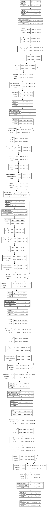
    


    <Figure size 200x200 with 0 Axes>


```python
def learning_rate_scheduler(epoch, lr): 
        if (epoch + 1) % 33 == 0:
           lr = lr / 10
        return lr
lrs = LearningRateScheduler(learning_rate_scheduler, verbose=1)
checkpointer = ModelCheckpoint(filepath='model.weights.best.hdf5', verbose=1, save_best_only=True)
```


```python
generator = ImageDataGenerator(rotation_range=15, width_shift_range=0.1, height_shift_range=0.1, horizontal_flip=True, vertical_flip=False)
generator.fit(Images_train)

history = model.fit(generator.flow(Images_train,Masks_train,batch_size = batch_size), callbacks=[checkpointer], 
    steps_per_epoch=Images_train.shape[0] // batch_size, epochs=epochs, verbose=2, validation_data=(Images_val, Masks_val))
```

    Epoch 1/100


    2023-10-13 20:43:37.414757: I tensorflow/core/grappler/optimizers/custom_graph_optimizer_registry.cc:114] Plugin optimizer for device_type GPU is enabled.
    2023-10-13 21:05:33.334846: I tensorflow/core/grappler/optimizers/custom_graph_optimizer_registry.cc:114] Plugin optimizer for device_type GPU is enabled.


    
    Epoch 1: val_loss improved from inf to 0.55337, saving model to model.weights.best.hdf5


    /Users/egormatolygin/anaconda3/envs/tensorflow/lib/python3.10/site-packages/keras/src/engine/training.py:3000: UserWarning: You are saving your model as an HDF5 file via `model.save()`. This file format is considered legacy. We recommend using instead the native Keras format, e.g. `model.save('my_model.keras')`.
      saving_api.save_model(


    588/588 - 1351s - loss: 0.6645 - accuracy: 0.7277 - val_loss: 0.5534 - val_accuracy: 0.7997 - 1351s/epoch - 2s/step
    Epoch 2/100
    
    Epoch 2: val_loss improved from 0.55337 to 0.52019, saving model to model.weights.best.hdf5
    588/588 - 1786s - loss: 0.5988 - accuracy: 0.7647 - val_loss: 0.5202 - val_accuracy: 0.8091 - 1786s/epoch - 3s/step
    Epoch 3/100
    
    Epoch 3: val_loss improved from 0.52019 to 0.48102, saving model to model.weights.best.hdf5
    588/588 - 1459s - loss: 0.5712 - accuracy: 0.7734 - val_loss: 0.4810 - val_accuracy: 0.8287 - 1459s/epoch - 2s/step
    Epoch 4/100
    
    Epoch 4: val_loss did not improve from 0.48102
    588/588 - 1656s - loss: 0.5519 - accuracy: 0.7766 - val_loss: 0.4877 - val_accuracy: 0.8085 - 1656s/epoch - 3s/step
    Epoch 5/100
    
    Epoch 5: val_loss improved from 0.48102 to 0.45374, saving model to model.weights.best.hdf5
    588/588 - 1632s - loss: 0.5372 - accuracy: 0.7793 - val_loss: 0.4537 - val_accuracy: 0.8273 - 1632s/epoch - 3s/step
    Epoch 6/100
    
    Epoch 6: val_loss improved from 0.45374 to 0.45128, saving model to model.weights.best.hdf5
    588/588 - 1353s - loss: 0.5240 - accuracy: 0.7820 - val_loss: 0.4513 - val_accuracy: 0.8283 - 1353s/epoch - 2s/step
    Epoch 7/100
    
    Epoch 7: val_loss improved from 0.45128 to 0.42530, saving model to model.weights.best.hdf5
    588/588 - 1580s - loss: 0.5135 - accuracy: 0.7826 - val_loss: 0.4253 - val_accuracy: 0.8400 - 1580s/epoch - 3s/step
    Epoch 8/100
    
    Epoch 8: val_loss did not improve from 0.42530
    588/588 - 1675s - loss: 0.5018 - accuracy: 0.7855 - val_loss: 0.4284 - val_accuracy: 0.8334 - 1675s/epoch - 3s/step
    Epoch 9/100
    
    Epoch 9: val_loss improved from 0.42530 to 0.40047, saving model to model.weights.best.hdf5
    588/588 - 1689s - loss: 0.4932 - accuracy: 0.7878 - val_loss: 0.4005 - val_accuracy: 0.8498 - 1689s/epoch - 3s/step
    Epoch 10/100
    
    Epoch 10: val_loss improved from 0.40047 to 0.38294, saving model to model.weights.best.hdf5
    588/588 - 1694s - loss: 0.4846 - accuracy: 0.7892 - val_loss: 0.3829 - val_accuracy: 0.8536 - 1694s/epoch - 3s/step
    Epoch 11/100
    
    Epoch 11: val_loss improved from 0.38294 to 0.37387, saving model to model.weights.best.hdf5
    588/588 - 1683s - loss: 0.4783 - accuracy: 0.7910 - val_loss: 0.3739 - val_accuracy: 0.8573 - 1683s/epoch - 3s/step
    Epoch 12/100
    
    Epoch 12: val_loss did not improve from 0.37387
    588/588 - 1691s - loss: 0.4696 - accuracy: 0.7936 - val_loss: 0.3965 - val_accuracy: 0.8293 - 1691s/epoch - 3s/step
    Epoch 13/100
    
    Epoch 13: val_loss did not improve from 0.37387
    588/588 - 1680s - loss: 0.4686 - accuracy: 0.7918 - val_loss: 0.4036 - val_accuracy: 0.8399 - 1680s/epoch - 3s/step
    Epoch 14/100
    
    Epoch 14: val_loss did not improve from 0.37387
    588/588 - 1680s - loss: 0.4631 - accuracy: 0.7941 - val_loss: 0.3877 - val_accuracy: 0.8568 - 1680s/epoch - 3s/step
    Epoch 15/100
    
    Epoch 15: val_loss improved from 0.37387 to 0.34871, saving model to model.weights.best.hdf5
    588/588 - 1687s - loss: 0.4587 - accuracy: 0.7945 - val_loss: 0.3487 - val_accuracy: 0.8595 - 1687s/epoch - 3s/step
    Epoch 16/100
    
    Epoch 16: val_loss did not improve from 0.34871
    588/588 - 1617s - loss: 0.4555 - accuracy: 0.7954 - val_loss: 0.3752 - val_accuracy: 0.8426 - 1617s/epoch - 3s/step
    Epoch 17/100
    
    Epoch 17: val_loss did not improve from 0.34871
    588/588 - 1402s - loss: 0.4497 - accuracy: 0.7974 - val_loss: 0.3634 - val_accuracy: 0.8580 - 1402s/epoch - 2s/step
    Epoch 18/100
    
    Epoch 18: val_loss did not improve from 0.34871
    588/588 - 1395s - loss: 0.4491 - accuracy: 0.7970 - val_loss: 0.3530 - val_accuracy: 0.8560 - 1395s/epoch - 2s/step
    Epoch 19/100
    
    Epoch 19: val_loss did not improve from 0.34871
    588/588 - 1398s - loss: 0.4445 - accuracy: 0.7990 - val_loss: 0.3505 - val_accuracy: 0.8554 - 1398s/epoch - 2s/step
    Epoch 20/100
    
    Epoch 20: val_loss did not improve from 0.34871
    588/588 - 1399s - loss: 0.4403 - accuracy: 0.8005 - val_loss: 0.3577 - val_accuracy: 0.8473 - 1399s/epoch - 2s/step
    Epoch 21/100
    
    Epoch 21: val_loss improved from 0.34871 to 0.34129, saving model to model.weights.best.hdf5
    588/588 - 1399s - loss: 0.4397 - accuracy: 0.7998 - val_loss: 0.3413 - val_accuracy: 0.8655 - 1399s/epoch - 2s/step
    Epoch 22/100
    
    Epoch 22: val_loss improved from 0.34129 to 0.32862, saving model to model.weights.best.hdf5
    588/588 - 1394s - loss: 0.4356 - accuracy: 0.8015 - val_loss: 0.3286 - val_accuracy: 0.8712 - 1394s/epoch - 2s/step
    Epoch 23/100
    
    Epoch 23: val_loss improved from 0.32862 to 0.32201, saving model to model.weights.best.hdf5
    588/588 - 1388s - loss: 0.4329 - accuracy: 0.8024 - val_loss: 0.3220 - val_accuracy: 0.8669 - 1388s/epoch - 2s/step
    Epoch 24/100
    
    Epoch 24: val_loss did not improve from 0.32201
    588/588 - 1391s - loss: 0.4324 - accuracy: 0.8022 - val_loss: 0.3362 - val_accuracy: 0.8733 - 1391s/epoch - 2s/step
    Epoch 25/100
    
    Epoch 25: val_loss did not improve from 0.32201
    588/588 - 1318s - loss: 0.4292 - accuracy: 0.8033 - val_loss: 0.3388 - val_accuracy: 0.8681 - 1318s/epoch - 2s/step
    Epoch 26/100
    
    Epoch 26: val_loss did not improve from 0.32201
    588/588 - 1383s - loss: 0.4268 - accuracy: 0.8046 - val_loss: 0.3303 - val_accuracy: 0.8704 - 1383s/epoch - 2s/step
    Epoch 27/100
    
    Epoch 27: val_loss did not improve from 0.32201
    588/588 - 1533s - loss: 0.4247 - accuracy: 0.8047 - val_loss: 0.3627 - val_accuracy: 0.8569 - 1533s/epoch - 3s/step
    Epoch 28/100
    
    Epoch 28: val_loss did not improve from 0.32201
    588/588 - 1361s - loss: 0.4268 - accuracy: 0.8037 - val_loss: 0.3474 - val_accuracy: 0.8591 - 1361s/epoch - 2s/step
    Epoch 29/100
    
    Epoch 29: val_loss did not improve from 0.32201
    588/588 - 1355s - loss: 0.4213 - accuracy: 0.8063 - val_loss: 0.3455 - val_accuracy: 0.8634 - 1355s/epoch - 2s/step
    Epoch 30/100
    
    Epoch 30: val_loss did not improve from 0.32201
    588/588 - 1340s - loss: 0.4178 - accuracy: 0.8074 - val_loss: 0.3332 - val_accuracy: 0.8587 - 1340s/epoch - 2s/step
    Epoch 31/100
    
    Epoch 31: val_loss did not improve from 0.32201
    588/588 - 1331s - loss: 0.4199 - accuracy: 0.8062 - val_loss: 0.3232 - val_accuracy: 0.8635 - 1331s/epoch - 2s/step
    Epoch 32/100
    
    Epoch 32: val_loss did not improve from 0.32201
    588/588 - 1343s - loss: 0.4178 - accuracy: 0.8072 - val_loss: 0.3252 - val_accuracy: 0.8657 - 1343s/epoch - 2s/step
    Epoch 33/100
    
    Epoch 33: val_loss did not improve from 0.32201
    588/588 - 1353s - loss: 0.4191 - accuracy: 0.8061 - val_loss: 0.3318 - val_accuracy: 0.8580 - 1353s/epoch - 2s/step
    Epoch 34/100
    
    Epoch 34: val_loss improved from 0.32201 to 0.31266, saving model to model.weights.best.hdf5
    588/588 - 1333s - loss: 0.4166 - accuracy: 0.8070 - val_loss: 0.3127 - val_accuracy: 0.8708 - 1333s/epoch - 2s/step
    Epoch 35/100
    
    Epoch 35: val_loss did not improve from 0.31266
    588/588 - 1319s - loss: 0.4131 - accuracy: 0.8088 - val_loss: 0.3168 - val_accuracy: 0.8720 - 1319s/epoch - 2s/step
    Epoch 36/100
    
    Epoch 36: val_loss did not improve from 0.31266
    588/588 - 1322s - loss: 0.4160 - accuracy: 0.8071 - val_loss: 0.3137 - val_accuracy: 0.8659 - 1322s/epoch - 2s/step
    Epoch 37/100
    
    Epoch 37: val_loss did not improve from 0.31266
    588/588 - 1321s - loss: 0.4128 - accuracy: 0.8081 - val_loss: 0.3235 - val_accuracy: 0.8733 - 1321s/epoch - 2s/step
    Epoch 38/100
    
    Epoch 38: val_loss did not improve from 0.31266
    588/588 - 1322s - loss: 0.4120 - accuracy: 0.8082 - val_loss: 0.3407 - val_accuracy: 0.8624 - 1322s/epoch - 2s/step
    Epoch 39/100
    
    Epoch 39: val_loss did not improve from 0.31266
    588/588 - 1313s - loss: 0.4107 - accuracy: 0.8092 - val_loss: 0.3298 - val_accuracy: 0.8587 - 1313s/epoch - 2s/step
    Epoch 40/100
    
    Epoch 40: val_loss did not improve from 0.31266
    588/588 - 1315s - loss: 0.4104 - accuracy: 0.8089 - val_loss: 0.3318 - val_accuracy: 0.8563 - 1315s/epoch - 2s/step
    Epoch 41/100
    
    Epoch 41: val_loss did not improve from 0.31266
    588/588 - 1343s - loss: 0.4098 - accuracy: 0.8091 - val_loss: 0.3130 - val_accuracy: 0.8668 - 1343s/epoch - 2s/step
    Epoch 42/100
    
    Epoch 42: val_loss did not improve from 0.31266
    588/588 - 1479s - loss: 0.4089 - accuracy: 0.8090 - val_loss: 0.3142 - val_accuracy: 0.8667 - 1479s/epoch - 3s/step
    Epoch 43/100
    
    Epoch 43: val_loss did not improve from 0.31266
    588/588 - 1371s - loss: 0.4062 - accuracy: 0.8112 - val_loss: 0.3411 - val_accuracy: 0.8636 - 1371s/epoch - 2s/step
    Epoch 44/100
    
    Epoch 44: val_loss improved from 0.31266 to 0.30488, saving model to model.weights.best.hdf5
    588/588 - 1561s - loss: 0.4081 - accuracy: 0.8096 - val_loss: 0.3049 - val_accuracy: 0.8785 - 1561s/epoch - 3s/step
    Epoch 45/100
    
    Epoch 45: val_loss improved from 0.30488 to 0.29895, saving model to model.weights.best.hdf5
    588/588 - 1469s - loss: 0.4057 - accuracy: 0.8109 - val_loss: 0.2989 - val_accuracy: 0.8732 - 1469s/epoch - 2s/step
    Epoch 46/100
    
    Epoch 46: val_loss improved from 0.29895 to 0.29011, saving model to model.weights.best.hdf5
    588/588 - 1640s - loss: 0.4052 - accuracy: 0.8116 - val_loss: 0.2901 - val_accuracy: 0.8812 - 1640s/epoch - 3s/step
    Epoch 47/100
    
    Epoch 47: val_loss did not improve from 0.29011
    588/588 - 1530s - loss: 0.4061 - accuracy: 0.8103 - val_loss: 0.3060 - val_accuracy: 0.8705 - 1530s/epoch - 3s/step
    Epoch 48/100
    
    Epoch 48: val_loss did not improve from 0.29011
    588/588 - 1471s - loss: 0.4044 - accuracy: 0.8106 - val_loss: 0.3079 - val_accuracy: 0.8768 - 1471s/epoch - 3s/step
    Epoch 49/100
    
    Epoch 49: val_loss did not improve from 0.29011
    588/588 - 1456s - loss: 0.4056 - accuracy: 0.8100 - val_loss: 0.3148 - val_accuracy: 0.8712 - 1456s/epoch - 2s/step
    Epoch 50/100
    
    Epoch 50: val_loss did not improve from 0.29011
    588/588 - 1721s - loss: 0.3996 - accuracy: 0.8135 - val_loss: 0.3185 - val_accuracy: 0.8642 - 1721s/epoch - 3s/step
    Epoch 51/100
    
    Epoch 51: val_loss did not improve from 0.29011
    588/588 - 1363s - loss: 0.4004 - accuracy: 0.8130 - val_loss: 0.3303 - val_accuracy: 0.8555 - 1363s/epoch - 2s/step
    Epoch 52/100
    
    Epoch 52: val_loss did not improve from 0.29011
    588/588 - 1440s - loss: 0.4020 - accuracy: 0.8118 - val_loss: 0.3206 - val_accuracy: 0.8614 - 1440s/epoch - 2s/step
    Epoch 53/100
    
    Epoch 53: val_loss did not improve from 0.29011
    588/588 - 1425s - loss: 0.3989 - accuracy: 0.8131 - val_loss: 0.3309 - val_accuracy: 0.8597 - 1425s/epoch - 2s/step
    Epoch 54/100
    
    Epoch 54: val_loss did not improve from 0.29011
    588/588 - 1462s - loss: 0.3991 - accuracy: 0.8128 - val_loss: 0.3218 - val_accuracy: 0.8687 - 1462s/epoch - 2s/step
    Epoch 55/100
    
    Epoch 55: val_loss did not improve from 0.29011
    588/588 - 1377s - loss: 0.4000 - accuracy: 0.8124 - val_loss: 0.2990 - val_accuracy: 0.8707 - 1377s/epoch - 2s/step
    Epoch 56/100
    
    Epoch 56: val_loss did not improve from 0.29011
    588/588 - 1543s - loss: 0.4026 - accuracy: 0.8110 - val_loss: 0.3085 - val_accuracy: 0.8671 - 1543s/epoch - 3s/step
    Epoch 57/100
    
    Epoch 57: val_loss did not improve from 0.29011
    588/588 - 1888s - loss: 0.3988 - accuracy: 0.8131 - val_loss: 0.3272 - val_accuracy: 0.8695 - 1888s/epoch - 3s/step
    Epoch 58/100
    
    Epoch 58: val_loss did not improve from 0.29011
    588/588 - 1350s - loss: 0.3945 - accuracy: 0.8152 - val_loss: 0.3125 - val_accuracy: 0.8758 - 1350s/epoch - 2s/step
    Epoch 59/100
    
    Epoch 59: val_loss did not improve from 0.29011
    588/588 - 1553s - loss: 0.3976 - accuracy: 0.8132 - val_loss: 0.3072 - val_accuracy: 0.8653 - 1553s/epoch - 3s/step
    Epoch 60/100
    
    Epoch 60: val_loss did not improve from 0.29011
    588/588 - 1708s - loss: 0.3952 - accuracy: 0.8149 - val_loss: 0.3017 - val_accuracy: 0.8787 - 1708s/epoch - 3s/step
    Epoch 61/100
    
    Epoch 61: val_loss did not improve from 0.29011
    588/588 - 1565s - loss: 0.3966 - accuracy: 0.8138 - val_loss: 0.3031 - val_accuracy: 0.8710 - 1565s/epoch - 3s/step
    Epoch 62/100
    
    Epoch 62: val_loss did not improve from 0.29011
    588/588 - 1637s - loss: 0.3972 - accuracy: 0.8135 - val_loss: 0.3108 - val_accuracy: 0.8731 - 1637s/epoch - 3s/step
    Epoch 63/100
    
    Epoch 63: val_loss did not improve from 0.29011
    588/588 - 1638s - loss: 0.3941 - accuracy: 0.8147 - val_loss: 0.3097 - val_accuracy: 0.8759 - 1638s/epoch - 3s/step
    Epoch 64/100
    
    Epoch 64: val_loss did not improve from 0.29011
    588/588 - 1514s - loss: 0.3934 - accuracy: 0.8154 - val_loss: 0.3157 - val_accuracy: 0.8601 - 1514s/epoch - 3s/step
    Epoch 65/100
    
    Epoch 65: val_loss did not improve from 0.29011
    588/588 - 1383s - loss: 0.3926 - accuracy: 0.8157 - val_loss: 0.3114 - val_accuracy: 0.8590 - 1383s/epoch - 2s/step
    Epoch 66/100
    
    Epoch 66: val_loss did not improve from 0.29011
    588/588 - 1458s - loss: 0.3933 - accuracy: 0.8152 - val_loss: 0.2950 - val_accuracy: 0.8758 - 1458s/epoch - 2s/step
    Epoch 67/100
    
    Epoch 67: val_loss did not improve from 0.29011
    588/588 - 1491s - loss: 0.3946 - accuracy: 0.8143 - val_loss: 0.3485 - val_accuracy: 0.8491 - 1491s/epoch - 3s/step
    Epoch 68/100
    
    Epoch 68: val_loss did not improve from 0.29011
    588/588 - 1512s - loss: 0.3918 - accuracy: 0.8162 - val_loss: 0.3000 - val_accuracy: 0.8722 - 1512s/epoch - 3s/step
    Epoch 69/100
    
    Epoch 69: val_loss did not improve from 0.29011
    588/588 - 1513s - loss: 0.3914 - accuracy: 0.8160 - val_loss: 0.2930 - val_accuracy: 0.8670 - 1513s/epoch - 3s/step
    Epoch 70/100
    
    Epoch 70: val_loss did not improve from 0.29011
    588/588 - 1521s - loss: 0.3964 - accuracy: 0.8134 - val_loss: 0.3129 - val_accuracy: 0.8652 - 1521s/epoch - 3s/step
    Epoch 71/100
    
    Epoch 71: val_loss did not improve from 0.29011
    588/588 - 1516s - loss: 0.3904 - accuracy: 0.8166 - val_loss: 0.3399 - val_accuracy: 0.8622 - 1516s/epoch - 3s/step
    Epoch 72/100
    
    Epoch 72: val_loss did not improve from 0.29011
    588/588 - 1519s - loss: 0.3916 - accuracy: 0.8157 - val_loss: 0.3372 - val_accuracy: 0.8513 - 1519s/epoch - 3s/step
    Epoch 73/100
    
    Epoch 73: val_loss did not improve from 0.29011
    588/588 - 1569s - loss: 0.3896 - accuracy: 0.8166 - val_loss: 0.3078 - val_accuracy: 0.8703 - 1569s/epoch - 3s/step
    Epoch 74/100
    
    Epoch 74: val_loss did not improve from 0.29011
    588/588 - 1500s - loss: 0.3917 - accuracy: 0.8153 - val_loss: 0.3094 - val_accuracy: 0.8670 - 1500s/epoch - 3s/step
    Epoch 75/100
    
    Epoch 75: val_loss did not improve from 0.29011
    588/588 - 1448s - loss: 0.3889 - accuracy: 0.8172 - val_loss: 0.2975 - val_accuracy: 0.8729 - 1448s/epoch - 2s/step
    Epoch 76/100
    
    Epoch 76: val_loss did not improve from 0.29011
    588/588 - 1448s - loss: 0.3899 - accuracy: 0.8167 - val_loss: 0.3230 - val_accuracy: 0.8613 - 1448s/epoch - 2s/step
    Epoch 77/100
    
    Epoch 77: val_loss did not improve from 0.29011
    588/588 - 1454s - loss: 0.3890 - accuracy: 0.8168 - val_loss: 0.3028 - val_accuracy: 0.8693 - 1454s/epoch - 2s/step
    Epoch 78/100
    
    Epoch 78: val_loss improved from 0.29011 to 0.28358, saving model to model.weights.best.hdf5
    588/588 - 1448s - loss: 0.3873 - accuracy: 0.8175 - val_loss: 0.2836 - val_accuracy: 0.8761 - 1448s/epoch - 2s/step
    Epoch 79/100
    
    Epoch 79: val_loss did not improve from 0.28358
    588/588 - 1449s - loss: 0.3887 - accuracy: 0.8171 - val_loss: 0.3103 - val_accuracy: 0.8652 - 1449s/epoch - 2s/step
    Epoch 80/100
    
    Epoch 80: val_loss did not improve from 0.28358
    588/588 - 1450s - loss: 0.3884 - accuracy: 0.8169 - val_loss: 0.3154 - val_accuracy: 0.8641 - 1450s/epoch - 2s/step
    Epoch 81/100
    
    Epoch 81: val_loss did not improve from 0.28358
    588/588 - 1448s - loss: 0.3904 - accuracy: 0.8157 - val_loss: 0.3173 - val_accuracy: 0.8664 - 1448s/epoch - 2s/step
    Epoch 82/100
    
    Epoch 82: val_loss did not improve from 0.28358
    588/588 - 1455s - loss: 0.3897 - accuracy: 0.8158 - val_loss: 0.3120 - val_accuracy: 0.8643 - 1455s/epoch - 2s/step
    Epoch 83/100
    
    Epoch 83: val_loss did not improve from 0.28358
    588/588 - 1446s - loss: 0.3876 - accuracy: 0.8173 - val_loss: 0.3190 - val_accuracy: 0.8687 - 1446s/epoch - 2s/step
    Epoch 84/100
    
    Epoch 84: val_loss did not improve from 0.28358
    588/588 - 1365s - loss: 0.3885 - accuracy: 0.8169 - val_loss: 0.3063 - val_accuracy: 0.8589 - 1365s/epoch - 2s/step
    Epoch 85/100
    
    Epoch 85: val_loss did not improve from 0.28358
    588/588 - 1425s - loss: 0.3873 - accuracy: 0.8171 - val_loss: 0.2999 - val_accuracy: 0.8673 - 1425s/epoch - 2s/step
    Epoch 86/100
    
    Epoch 86: val_loss did not improve from 0.28358
    588/588 - 1844s - loss: 0.3895 - accuracy: 0.8159 - val_loss: 0.3083 - val_accuracy: 0.8631 - 1844s/epoch - 3s/step
    Epoch 87/100
    
    Epoch 87: val_loss did not improve from 0.28358
    588/588 - 1615s - loss: 0.3851 - accuracy: 0.8182 - val_loss: 0.3850 - val_accuracy: 0.8213 - 1615s/epoch - 3s/step
    Epoch 88/100
    
    Epoch 88: val_loss did not improve from 0.28358
    588/588 - 1395s - loss: 0.3868 - accuracy: 0.8175 - val_loss: 0.3041 - val_accuracy: 0.8681 - 1395s/epoch - 2s/step
    Epoch 89/100
    
    Epoch 89: val_loss did not improve from 0.28358
    588/588 - 1536s - loss: 0.3866 - accuracy: 0.8174 - val_loss: 0.3098 - val_accuracy: 0.8618 - 1536s/epoch - 3s/step
    Epoch 90/100
    
    Epoch 90: val_loss did not improve from 0.28358
    588/588 - 1506s - loss: 0.3849 - accuracy: 0.8182 - val_loss: 0.3026 - val_accuracy: 0.8722 - 1506s/epoch - 3s/step
    Epoch 91/100
    
    Epoch 91: val_loss did not improve from 0.28358
    588/588 - 1686s - loss: 0.3873 - accuracy: 0.8164 - val_loss: 0.2980 - val_accuracy: 0.8710 - 1686s/epoch - 3s/step
    Epoch 92/100
    
    Epoch 92: val_loss did not improve from 0.28358
    588/588 - 1675s - loss: 0.3885 - accuracy: 0.8155 - val_loss: 0.3095 - val_accuracy: 0.8676 - 1675s/epoch - 3s/step
    Epoch 93/100
    
    Epoch 93: val_loss did not improve from 0.28358
    588/588 - 1660s - loss: 0.3844 - accuracy: 0.8183 - val_loss: 0.2990 - val_accuracy: 0.8752 - 1660s/epoch - 3s/step
    Epoch 94/100
    
    Epoch 94: val_loss did not improve from 0.28358
    588/588 - 1690s - loss: 0.3852 - accuracy: 0.8174 - val_loss: 0.3058 - val_accuracy: 0.8684 - 1690s/epoch - 3s/step
    Epoch 95/100
    
    Epoch 95: val_loss did not improve from 0.28358
    588/588 - 1449s - loss: 0.3851 - accuracy: 0.8181 - val_loss: 0.3104 - val_accuracy: 0.8659 - 1449s/epoch - 2s/step
    Epoch 96/100
    
    Epoch 96: val_loss did not improve from 0.28358
    588/588 - 1416s - loss: 0.3872 - accuracy: 0.8164 - val_loss: 0.3155 - val_accuracy: 0.8624 - 1416s/epoch - 2s/step
    Epoch 97/100
    
    Epoch 97: val_loss improved from 0.28358 to 0.27964, saving model to model.weights.best.hdf5
    588/588 - 1387s - loss: 0.3821 - accuracy: 0.8198 - val_loss: 0.2796 - val_accuracy: 0.8759 - 1387s/epoch - 2s/step
    Epoch 98/100
    
    Epoch 98: val_loss did not improve from 0.27964
    588/588 - 1278s - loss: 0.3835 - accuracy: 0.8189 - val_loss: 0.2957 - val_accuracy: 0.8719 - 1278s/epoch - 2s/step
    Epoch 99/100
    
    Epoch 99: val_loss did not improve from 0.27964
    588/588 - 1271s - loss: 0.3865 - accuracy: 0.8172 - val_loss: 0.3223 - val_accuracy: 0.8519 - 1271s/epoch - 2s/step
    Epoch 100/100
    
    Epoch 100: val_loss did not improve from 0.27964
    588/588 - 1573s - loss: 0.3839 - accuracy: 0.8181 - val_loss: 0.2880 - val_accuracy: 0.8780 - 1573s/epoch - 3s/step


```python
plt.plot(history.history['loss'], label='train')
plt.plot(history.history['val_loss'], label='test')
plt.ylim((0,1))
plt.legend()
plt.show()
```


    
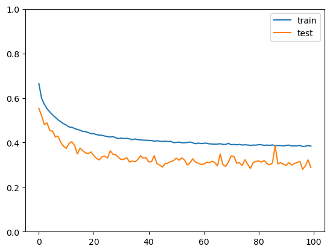
    


```python
model = get_model1()
model.load_weights("/Users/egormatolygin/Desktop/Полка/Pet_projects/back_blure/weights/model1.0.weights.best.hdf5")
```

    Model: "model_1"
    __________________________________________________________________________________________________
     Layer (type)                Output Shape                 Param #   Connected to                  
    ==================================================================================================
     input_2 (InputLayer)        [(None, 256, 256, 3)]        0         []                            
                                                                                                      
     conv2d_15 (Conv2D)          (None, 256, 256, 64)         1792      ['input_2[0][0]']             
                                                                                                      
     batch_normalization_17 (Ba  (None, 256, 256, 64)         256       ['conv2d_15[0][0]']           
     tchNormalization)                                                                                
                                                                                                      
     activation_17 (Activation)  (None, 256, 256, 64)         0         ['batch_normalization_17[0][0]
                                                                        ']                            
                                                                                                      
     conv2d_16 (Conv2D)          (None, 256, 256, 64)         36928     ['activation_17[0][0]']       
                                                                                                      
     batch_normalization_18 (Ba  (None, 256, 256, 64)         256       ['conv2d_16[0][0]']           
     tchNormalization)                                                                                
                                                                                                      
     activation_18 (Activation)  (None, 256, 256, 64)         0         ['batch_normalization_18[0][0]
                                                                        ']                            
                                                                                                      
     max_pooling2d_3 (MaxPoolin  (None, 128, 128, 64)         0         ['activation_18[0][0]']       
     g2D)                                                                                             
                                                                                                      
     conv2d_17 (Conv2D)          (None, 128, 128, 64)         36928     ['max_pooling2d_3[0][0]']     
                                                                                                      
     batch_normalization_19 (Ba  (None, 128, 128, 64)         256       ['conv2d_17[0][0]']           
     tchNormalization)                                                                                
                                                                                                      
     activation_19 (Activation)  (None, 128, 128, 64)         0         ['batch_normalization_19[0][0]
                                                                        ']                            
                                                                                                      
     conv2d_18 (Conv2D)          (None, 128, 128, 64)         36928     ['activation_19[0][0]']       
                                                                                                      
     batch_normalization_20 (Ba  (None, 128, 128, 64)         256       ['conv2d_18[0][0]']           
     tchNormalization)                                                                                
                                                                                                      
     activation_20 (Activation)  (None, 128, 128, 64)         0         ['batch_normalization_20[0][0]
                                                                        ']                            
                                                                                                      
     max_pooling2d_4 (MaxPoolin  (None, 64, 64, 64)           0         ['activation_20[0][0]']       
     g2D)                                                                                             
                                                                                                      
     conv2d_19 (Conv2D)          (None, 64, 64, 128)          73856     ['max_pooling2d_4[0][0]']     
                                                                                                      
     batch_normalization_21 (Ba  (None, 64, 64, 128)          512       ['conv2d_19[0][0]']           
     tchNormalization)                                                                                
                                                                                                      
     activation_21 (Activation)  (None, 64, 64, 128)          0         ['batch_normalization_21[0][0]
                                                                        ']                            
                                                                                                      
     conv2d_20 (Conv2D)          (None, 64, 64, 128)          147584    ['activation_21[0][0]']       
                                                                                                      
     batch_normalization_22 (Ba  (None, 64, 64, 128)          512       ['conv2d_20[0][0]']           
     tchNormalization)                                                                                
                                                                                                      
     activation_22 (Activation)  (None, 64, 64, 128)          0         ['batch_normalization_22[0][0]
                                                                        ']                            
                                                                                                      
     max_pooling2d_5 (MaxPoolin  (None, 32, 32, 128)          0         ['activation_22[0][0]']       
     g2D)                                                                                             
                                                                                                      
     conv2d_21 (Conv2D)          (None, 32, 32, 256)          295168    ['max_pooling2d_5[0][0]']     
                                                                                                      
     batch_normalization_23 (Ba  (None, 32, 32, 256)          1024      ['conv2d_21[0][0]']           
     tchNormalization)                                                                                
                                                                                                      
     activation_23 (Activation)  (None, 32, 32, 256)          0         ['batch_normalization_23[0][0]
                                                                        ']                            
                                                                                                      
     conv2d_22 (Conv2D)          (None, 32, 32, 256)          590080    ['activation_23[0][0]']       
                                                                                                      
     batch_normalization_24 (Ba  (None, 32, 32, 256)          1024      ['conv2d_22[0][0]']           
     tchNormalization)                                                                                
                                                                                                      
     activation_24 (Activation)  (None, 32, 32, 256)          0         ['batch_normalization_24[0][0]
                                                                        ']                            
                                                                                                      
     conv2d_transpose_3 (Conv2D  (None, 64, 64, 128)          295040    ['activation_24[0][0]']       
     Transpose)                                                                                       
                                                                                                      
     batch_normalization_25 (Ba  (None, 64, 64, 128)          512       ['conv2d_transpose_3[0][0]']  
     tchNormalization)                                                                                
                                                                                                      
     activation_25 (Activation)  (None, 64, 64, 128)          0         ['batch_normalization_25[0][0]
                                                                        ']                            
                                                                                                      
     concatenate_3 (Concatenate  (None, 64, 64, 256)          0         ['activation_25[0][0]',       
     )                                                                   'activation_22[0][0]']       
                                                                                                      
     conv2d_23 (Conv2D)          (None, 64, 64, 128)          295040    ['concatenate_3[0][0]']       
                                                                                                      
     batch_normalization_26 (Ba  (None, 64, 64, 128)          512       ['conv2d_23[0][0]']           
     tchNormalization)                                                                                
                                                                                                      
     activation_26 (Activation)  (None, 64, 64, 128)          0         ['batch_normalization_26[0][0]
                                                                        ']                            
                                                                                                      
     conv2d_24 (Conv2D)          (None, 64, 64, 128)          147584    ['activation_26[0][0]']       
                                                                                                      
     batch_normalization_27 (Ba  (None, 64, 64, 128)          512       ['conv2d_24[0][0]']           
     tchNormalization)                                                                                
                                                                                                      
     activation_27 (Activation)  (None, 64, 64, 128)          0         ['batch_normalization_27[0][0]
                                                                        ']                            
                                                                                                      
     conv2d_transpose_4 (Conv2D  (None, 128, 128, 64)         73792     ['activation_27[0][0]']       
     Transpose)                                                                                       
                                                                                                      
     batch_normalization_28 (Ba  (None, 128, 128, 64)         256       ['conv2d_transpose_4[0][0]']  
     tchNormalization)                                                                                
                                                                                                      
     activation_28 (Activation)  (None, 128, 128, 64)         0         ['batch_normalization_28[0][0]
                                                                        ']                            
                                                                                                      
     concatenate_4 (Concatenate  (None, 128, 128, 128)        0         ['activation_28[0][0]',       
     )                                                                   'activation_20[0][0]']       
                                                                                                      
     conv2d_25 (Conv2D)          (None, 128, 128, 64)         73792     ['concatenate_4[0][0]']       
                                                                                                      
     batch_normalization_29 (Ba  (None, 128, 128, 64)         256       ['conv2d_25[0][0]']           
     tchNormalization)                                                                                
                                                                                                      
     activation_29 (Activation)  (None, 128, 128, 64)         0         ['batch_normalization_29[0][0]
                                                                        ']                            
                                                                                                      
     conv2d_26 (Conv2D)          (None, 128, 128, 64)         36928     ['activation_29[0][0]']       
                                                                                                      
     batch_normalization_30 (Ba  (None, 128, 128, 64)         256       ['conv2d_26[0][0]']           
     tchNormalization)                                                                                
                                                                                                      
     activation_30 (Activation)  (None, 128, 128, 64)         0         ['batch_normalization_30[0][0]
                                                                        ']                            
                                                                                                      
     conv2d_transpose_5 (Conv2D  (None, 256, 256, 64)         36928     ['activation_30[0][0]']       
     Transpose)                                                                                       
                                                                                                      
     batch_normalization_31 (Ba  (None, 256, 256, 64)         256       ['conv2d_transpose_5[0][0]']  
     tchNormalization)                                                                                
                                                                                                      
     activation_31 (Activation)  (None, 256, 256, 64)         0         ['batch_normalization_31[0][0]
                                                                        ']                            
                                                                                                      
     concatenate_5 (Concatenate  (None, 256, 256, 128)        0         ['activation_31[0][0]',       
     )                                                                   'activation_18[0][0]']       
                                                                                                      
     conv2d_27 (Conv2D)          (None, 256, 256, 64)         73792     ['concatenate_5[0][0]']       
                                                                                                      
     batch_normalization_32 (Ba  (None, 256, 256, 64)         256       ['conv2d_27[0][0]']           
     tchNormalization)                                                                                
                                                                                                      
     activation_32 (Activation)  (None, 256, 256, 64)         0         ['batch_normalization_32[0][0]
                                                                        ']                            
                                                                                                      
     conv2d_29 (Conv2D)          (None, 256, 256, 1)          577       ['activation_32[0][0]']       
                                                                                                      
    ==================================================================================================
    Total params: 2259649 (8.62 MB)
    Trainable params: 2256193 (8.61 MB)
    Non-trainable params: 3456 (13.50 KB)
    __________________________________________________________________________________________________


    WARNING:absl:At this time, the v2.11+ optimizer `tf.keras.optimizers.Adam` runs slowly on M1/M2 Macs, please use the legacy Keras optimizer instead, located at `tf.keras.optimizers.legacy.Adam`.
    WARNING:absl:There is a known slowdown when using v2.11+ Keras optimizers on M1/M2 Macs. Falling back to the legacy Keras optimizer, i.e., `tf.keras.optimizers.legacy.Adam`.


```python
img = Image.open('/Users/egormatolygin/Desktop/Полка/Pet_projects/back_blure/images/jeff-dell-xps-framegrab-pi-webcam.jpg')
img = img.resize((Img_height,Img_width),resample = Image.BILINEAR)
img = np.array(img).reshape(1,256,256,3)
plt.imshow(img[0])
print(img.shape)

mask = model.predict(img)[0]
```

    (1, 256, 256, 3)
    1/1 [==============================] - 0s 23ms/step


    
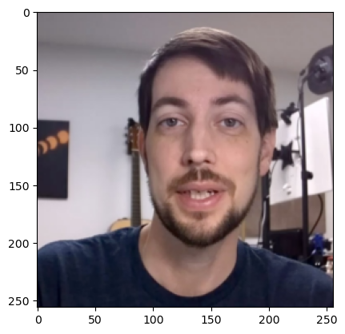
    


```python
def blure(img,mask):
    img = Image.fromarray(img[0])
    out = []
    blured = img.filter(ImageFilter.GaussianBlur(10))
    img = np.array(img)
    blured = np.array(blured)
    for i in range(256):
        for j in range(256):
            out.append((int(img[i][j][0]*mask[i][j]+blured[i][j][0]*(1-mask[i][j])),
                        int(img[i][j][1]*mask[i][j]+blured[i][j][1]*(1-mask[i][j])),
                        int(img[i][j][2]*mask[i][j]+blured[i][j][2]*(1-mask[i][j]))))
    out = np.array(out)
    out = out.reshape(256,256,3)
    return out
```


```python
mask[mask>0.7] = 1
plt.imshow(mask)
```


    <matplotlib.image.AxesImage at 0x293ffb5b0>


    
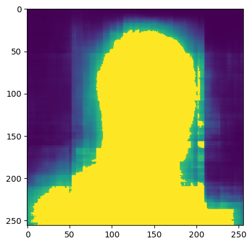
    


```python

plt.imshow(blure(img,mask))
```


    <matplotlib.image.AxesImage at 0x293eacb20>


    
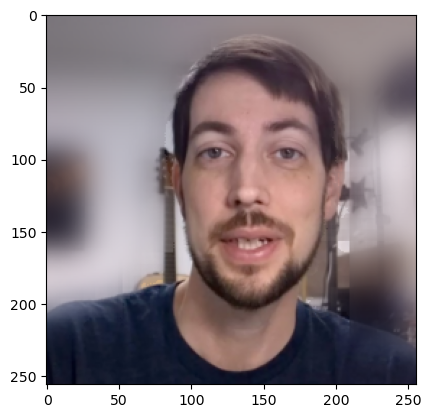
    


```python
def add_background(img,mask,background):
    img = img[0]
    background = background[0]
    out = []
    for i in range(256):
        for j in range(256):
            out.append((int(img[i][j][0]*mask[i][j]+background[i][j][0]*(1-mask[i][j])),
                        int(img[i][j][1]*mask[i][j]+background[i][j][1]*(1-mask[i][j])),
                        int(img[i][j][2]*mask[i][j]+background[i][j][2]*(1-mask[i][j]))))
    out = np.array(out)
    out = out.reshape(256,256,3)
    return out
```


```python
img = Image.open('/Users/egormatolygin/Desktop/Полка/Pet_projects/back_blure/images/jeff-dell-xps-framegrab-pi-webcam.jpg')
img = img.resize((Img_height,Img_width),resample = Image.BILINEAR)
img = np.array(img).reshape(1,256,256,3)
plt.imshow(img[0])
print(img.shape)
mask = model.predict(img)[0]

back = Image.open('/Users/egormatolygin/Desktop/Полка/Pet_projects/back_blure/images/champagne-beach-espiritu-santo-island-vanuatu-royalty-free-image-1655672510.jpg')
back = back.resize((Img_height,Img_width),resample = Image.BILINEAR)
back = np.array(back).reshape(1,256,256,3)
```

    (1, 256, 256, 3)
    1/1 [==============================] - 0s 19ms/step


    

    


```python
mask[mask>0.7] = 1
plt.imshow(add_background(img,mask,back))
mask[i][j]
```


    array([0.01651757], dtype=float32)


    
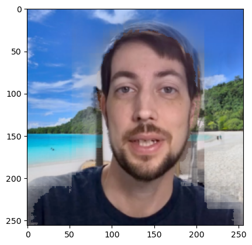
    


```python
img = Images_val[37]
img = np.array(img).reshape(1,256,256,3)
plt.imshow(img[0])
print(img.shape)
mask = model.predict(img)[0]
```

    (1, 256, 256, 3)
    1/1 [==============================] - 0s 22ms/step


    
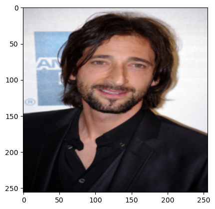
    


```python
mask[mask>0.7] = 1
plt.imshow(mask)
```


    <matplotlib.image.AxesImage at 0x296b2dd80>


    
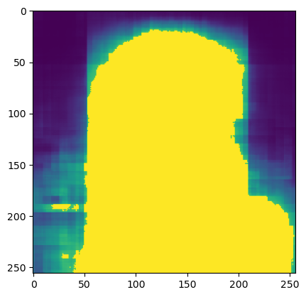
    


```python
plt.imshow(blure(img,mask))
```


    <matplotlib.image.AxesImage at 0x296956170>


    
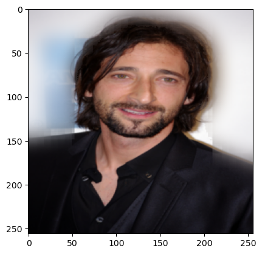
    


```python

```
